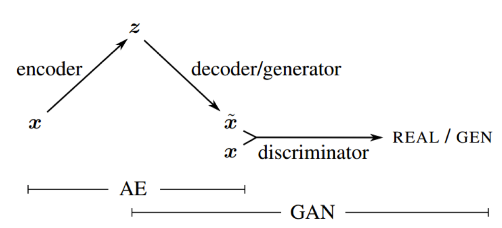
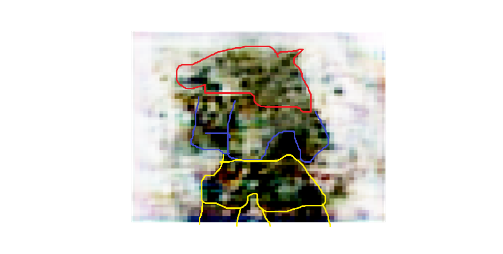
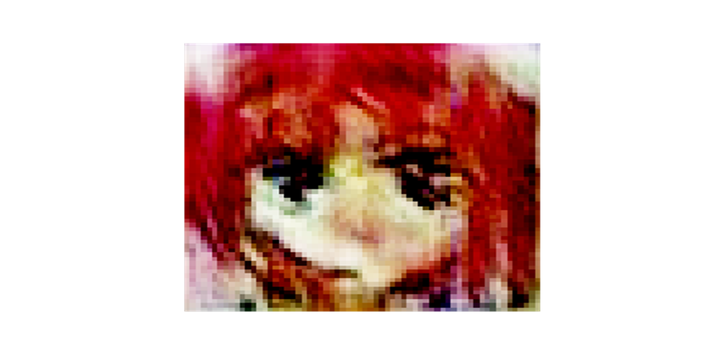

# Alpha-GAN-0.1 RU Version

### [Alpha-GAN-0.1 EN Version](#alpha-gan-01-en-version-1)

## Автор: _Rui Carter_

## Содержание:

- [Цель](#цель)
- [Введение](#введение)
- [Архитектура модели VAE-GAN](#архитектура-модели-vae-gan)
- [Набор данных](#набор-данных)
- [Обучение](#обучение)
- [Итог](#итог) 
- [Задачи](#задачи)
- [Технологии](#технологии-использованные-в-работе)

## Цель:

- ### Создать нейросеть которая будет рисовать изображения (например аниме, людей и так далее).

- ### Рассказать о том как работает нейросеть.

## Введение:

### На сегодняшний день нейросети стали нашим повседневным атребутом в жизни практически каждого человека.

### Для кого нейросеть нужна лишь для написания текста, ответов на вопросы и создания творчества и тому подобного.

### Сегодня я бы хотел остановиться на творчестве нейросетей и написать для вас статью о том как я делал первую версию нейросети Alpha, в чем были трудности и в чем были легкости.

## Архитектура модели VAE-GAN:

### Архитектура VAE-GAN - это комбинация двух моделей: вариационного автоэнкодера (VAE) и генеративно-состязательной сети (GAN). Она используется для генерации изображений с помощью обучения на нескольких наборах данных.

### VAE состоит из двух основных компонентов: энкодера и декодера. Энкодер преобразует входное изображение в латентное представление, которое затем передается декодеру для генерации выходного изображения. В процессе обучения VAE минимизирует разницу между входным и выходным изображением, а также между латентным представлением и его приближением.

### GAN состоит из двух сетей: генератора и дискриминатора. Генератор генерирует изображения, которые пытаются обмануть дискриминатор, который классифицирует изображения на реальные и фальшивые. В процессе обучения GAN минимизирует ошибку генератора и ошибку дискриминатора.

### VAE-GAN объединяет эти две модели, чтобы получить преимущества обеих. Энкодер VAE преобразует входное изображение в латентное представление, которое затем передается генератору GAN для генерации выходного изображения. Дискриминатор GAN классифицирует изображения на реальные и фальшивые, что помогает улучшить качество генерируемых изображений.

### Таким образом, архитектура VAE-GAN состоит из энкодера VAE, генератора GAN и дискриминатора GAN. Она использует функцию потерь, которая сочетает ошибки VAE и GAN, чтобы обеспечить более стабильное и качественное обучение. 

### Подробнее можно почитать о VAE-GAN на сайте [Baeldung](https://www.baeldung.com/cs/vae-vs-gan-image-generation).

## Набор данных:

### Я использовал набор данных [Anime Face Dataset](https://www.kaggle.com/datasets/splcher/animefacedataset).

### Почему я использовал этот набор? Потому что приемущества этого набора в том что:

- ### Во-первых, готовый набор с огромным количеством аниме лиц.
- ### Во-вторых, удобные изображения для обучения нейросети (легче определять признаки лиц, а также не мешает задний фон так как его нет.).

### По этим выше причинам я импользовал этот набор данных. 

### Конечно можно использовать и другие наборы данных, например свои, наборы данных с фоном, но это не факт, что нейросети будет легче определять их основные признаки и также не факт, что придется менять модель практически кардинально.

### Например вот одна из картинок при которой я обучал нейросеть на своём наборе данных.

_жёлтый - ноги, шорты; синий - торс, руки; красный - голова, волосы, уши;_

### Я обучал нейросеть на 90 разных изображений с одним персонажем в разных позах, стилях и задним планом.

### В течении 681 эпох мы видем, что она показало как по мне удовлетворительный результат, но не настолько удовлетворительный, чтобы человек смог распознать без определителей.

### Поэтому итог такой для этой части статьи так это то что лучше всего использовать пока уже готовый набор данных или создать такой набор данных, чтобы нейросети было легко обучаться на нем.

## Обучение

### Я использовал глубокое обучение с методом самоучителя. То есть эти две нейросети обучаются самомтоятельно в течении N-ого количество эпох.

### Также я использовал Binar Crossentropy в качестве потерь так как она себя отлично показывает на практике чем MSE (Mean Squared Error).

### Касаемо оптимизаторов, я использовал разные оптимизаторы и среди них Adam оказался лучшим чем к примеру SGD.

### Подробнее об обучении и моделях Вы можете узнать в моём блокноте.

### Я не хочу особо на этом зацикливаться и мне больше всего хочеться показать Вам то что выдало моя нейросеть в течении 81 эпохи.

_74 эпоха, самая лучшая эпоха_

### Обучая нейросеть я изначально столкнулся с проблемой пиксилизации и размытием, она возникает тогда когда размерность изображения уменьшаеться в энкодере и после декодер (генератор) возращает её в исходное состояние.

### Конечно это легко решить сделав изображение более большой размерностьи, но есть подводные камни.

### Во-первых, если сделать размерность больше то нам выдаст ошибку о том что GPU (Видиокарта) не может поддерживать такое количество нейронов в входном слое.

### Во-вторых, даже если GPU не будет жаловаться то не факт то что он будет обучаться медленей чем обычно и не факт что Ваш ПК не пострадает после этого.

### Также есть проблема с оптимизацией. Нейросеть при обучении потребляет около 12.5 гигов GPU. Это очень плохо. Поэтому есть решение тому чтобы уменьшить размерность изображения, но эта проблема вытикает из проблемы с пикселями.

### Итог:

### Подводя итоги, я смог сделать нейросеть которая может рисовать разные аниме лица. Также я смог рассказать как работает нейросеть.

## Задачи:

- ### Решить проблемы с обучением. 
- ### Уменьшить потребление GPU.
- ### Сделать возможность рисовать с фоном и в разных позах.

## Технологии использованные в работе:

- ### keras
- ### tensorflow
- ### matplotlib
- ### numpy
- ### time
- ### scikit-image
- ### datatime
- ### pillow

# Alpha-GAN-0.1 EN Version

## Author: _Rui Carter_

## Content:

- [Target](#target)
- [Intro](#intro)
- [VAE-GAN model architecture](#vae-gan-model-architecture)
- [Dataset](#dataset)
- [Training](#training)
- [Total](#total)
- [Tasks](#tasks)
- [Technologies](#technologies-used-in-work)

## Target:

- ### Create a neural network that will draw images (for example, anime, people, and so on).

- ### Talk about how the neural network works.

## Introduction:

### To date, neural networks have become our everyday attribute in the life of almost every person.

### For whom a neural network is needed only for writing text, answering questions and creating creativity and the like.

### Today I would like to dwell on the creativity of neural networks and write an article for you about how I made the first version of the Alpha neural network, what were the difficulties and what were the eases.

## VAE-GAN model architecture:

### The VAE-GAN architecture is a combination of two models: Variational Autoencoder (VAE) and Generative Adversarial Network (GAN). It is used to generate images by training on multiple datasets.

### A VAE consists of two main components: an encoder and a decoder. The encoder converts the input image into a latent representation, which is then passed to the decoder to generate an output image. During the training process, VAE minimizes the difference between the input and output image, as well as between the latent representation and its approximation.

### A GAN consists of two networks: a generator and a discriminator. The generator generates images that try to fool the discriminator, which classifies the images into real and fake. During the training process, the GAN minimizes the generator error and the discriminator error.
### VAE-GAN combines these two models to take advantage of both. The VAE encoder converts the input image into a latent representation, which is then passed to the GAN generator to generate the output image. The GAN discriminator classifies images into real and fake, which helps improve the quality of generated images.

### Thus, the VAE-GAN architecture consists of a VAE encoder, a GAN generator, and a GAN discriminator. It uses a loss function that combines VAE and GAN errors to provide more stable and better training.

### You can read more about VAE-GAN at [Baeldung](https://www.baeldung.com/cs/vae-vs-gan-image-generation).

## Data set:

### I used the [Anime Face Dataset](https://www.kaggle.com/datasets/splcher/animefacedataset).

### Why did I use this set? Because the advantages of this set are that:

- ### First, a ready-made set with a huge number of anime faces.
- ### Secondly, convenient images for training the neural network (it is easier to determine the signs of faces, and the background does not interfere since it does not exist.).

### For the above reasons, I used this data set.

### Of course, you can use other datasets, for example, your own, datasets with a background, but this is not a fact that it will be easier for neural networks to determine their main features, and it is also not a fact that you will have to change the model almost drastically.

### For example, here is one of the pictures in which I trained a neural network on my data set.

_yellow - legs, shorts; blue - torso, arms; red - head, hair, ears;_

### I trained a neural network on 90 different images with one character in different poses, styles and backgrounds.

### Over the course of 681 epochs, we see that it showed a satisfactory result for me, but not so satisfactory that a person could recognize without qualifiers.

### Therefore, the result for this part of the article is that it is best to use a data set that is already ready or create such a data set so that it is easy for a neural network to train on it.

## Education

### I used deep learning with a tutorial method. That is, these two neural networks are trained independently during the N-th number of epochs.

### I also used Binar Crossentropy as a loss because it performs better in practice than MSE (Mean Squared Error).

### Regarding optimizers, I used different optimizers and among them Adam turned out to be better than for example SGD.

### You can learn more about training and models in my notebook.

### I don't want to get too hung up on this, and most of all I want to show you what my neural network produced during 81 epochs.

_74 era, the best era_

### When training a neural network, I initially encountered the problem of pixelization and blurring, it occurs when the image dimension decreases in the encoder and after the decoder (generator) returns it to its original state.

### Of course this is easy to solve by making the image larger, but there are pitfalls.

### Firstly, if we make the dimension larger, we will get an error saying that the GPU (Video Card) cannot support such a number of neurons in the input layer.

### Secondly, even if the GPU does not complain, it is not a fact that it will learn more slowly than usual and it is not a fact that your PC will not suffer after that.

### There is also an optimization issue. The neural network during training consumes about 12.5 gigs of GPU. This is very bad. Therefore, there is a solution to reduce the dimensionality of the image, but this problem stems from the pixel problem.

### Result:

### Summing up, I was able to make a neural network that can draw different anime faces. I was also able to tell how the neural network works.

### Tasks:

- ### Solve learning problems.
- ### Reduce GPU consumption.
- ### Make it possible to draw with a background and in different poses.

## Technologies used in the work:

- ### keras
- ### tensorflow
- ### matplotlib
- ### numpy
- ### time
- ### scikit-image
- ### datatime
- ### pillow